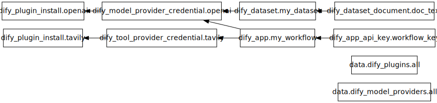

# Dify Terraform Provider

A Terraform provider for managing [Dify](https://dify.ai) applications, model provider credentials, plugins, and API keys as infrastructure-as-code.

**Important**: This provider requires the Dify backend to be running on the `demo/tf` branch from [wylswz/dify](https://github.com/wylswz/dify/tree/demo/tf), which includes the provisioning API endpoints for tool provider credentials.

## Requirements

- [Terraform](https://www.terraform.io/downloads.html) >= 1.0
- [Go](https://go.dev/dl/) >= 1.22 (to build the provider)
- Dify backend on the `demo/tf` branch from [wylswz/dify](https://github.com/wylswz/dify/tree/demo/tf)

## Quick Start

```hcl
terraform {
  required_providers {
    dify = {
      source  = "registry.terraform.io/dify/dify"
      version = "0.1.0"
    }
  }
}

provider "dify" {
  host         = "https://dify.example.com"
  api_key      = var.dify_admin_api_key
  workspace_id = var.dify_workspace_id
}
```

## Provider Configuration

| Attribute | Environment Variable | Description | Required |
|---|---|---|---|
| `host` | `DIFY_HOST` | Dify API base URL | No (defaults to `http://localhost`) |
| `api_key` | `DIFY_API_KEY` | Admin API key (`X-Admin-Api-Key` header) | Yes |
| `workspace_id` | `DIFY_WORKSPACE_ID` | Default workspace ID | Yes |

**Prerequisite**: The Dify instance must have `ADMIN_API_KEY` configured in its environment.



## Resources

### `dify_app`

Manages a Dify application via DSL YAML content. The app lifecycle (create, update, delete) is driven by the DSL content.

```hcl
resource "dify_app" "my_workflow" {
  creator_email = "admin@example.com"
  dsl_yaml      = file("my-workflow.yaml")
  name          = "My Workflow"
  description   = "A workflow managed by Terraform"
}
```

| Attribute | Type | Description |
|---|---|---|
| `dsl_yaml` | String (required) | DSL YAML content defining the app |
| `creator_email` | String (required) | Email of the workspace member who owns the app |
| `name` | String (optional) | Override app name from DSL |
| `description` | String (optional) | Override app description from DSL |
| `id` | String (computed) | App ID |
| `mode` | String (computed) | App mode (`chat`, `workflow`, `agent-chat`, etc.) |
| `enable_site` | Bool (computed) | Whether the web app site is enabled |
| `enable_api` | Bool (computed) | Whether the service API is enabled |

### `dify_model_provider_credential`

Manages model provider credentials (e.g. OpenAI API key, Anthropic API key).

```hcl
resource "dify_model_provider_credential" "openai" {
  provider_name = "openai"
  name          = "production-key"
  credentials = {
    openai_api_key = "sk-..."
  }
}
```

| Attribute | Type | Description |
|---|---|---|
| `provider_name` | String (required) | Model provider name (e.g. `openai`, `anthropic`) |
| `credentials` | Map (required) | Credential key-value pairs |
| `name` | String (optional) | Human-readable name |
| `credential_id` | String (computed) | Credential ID |

### `dify_tool_provider_credential`

Manages builtin tool provider credentials (e.g. Tavily API key, Google Search API key).

**Important**: For plugin-based tool providers, `provider_name` must use the full format (e.g. `langgenius/tavily/tavily`), not just the short name. You can find the correct provider name via the `dify_plugins` data source.

```hcl
# Install the plugin first
resource "dify_plugin_install" "tavily" {
  plugin_unique_identifier = "langgenius/tavily:0.1.7@5fce9cf01fecda9ad92e5125397d2bb5497429baed276c7f14f033e7debd0abe"
  source                   = "marketplace"
}

# Then configure credentials
resource "dify_tool_provider_credential" "tavily" {
  provider_name = "langgenius/tavily/tavily"
  name          = "production-key"
  credentials = {
    tavily_api_key = "tvly-..."
  }

  depends_on = [dify_plugin_install.tavily]
}
```

| Attribute | Type | Description |
|---|---|---|
| `provider_name` | String (required) | Tool provider name (use full format for plugins: `langgenius/tavily/tavily`) |
| `credentials` | Map (required) | Credential key-value pairs |
| `name` | String (optional) | Human-readable name |
| `credential_id` | String (computed) | Credential ID |

### `dify_plugin_install`

Manages plugin installation from marketplace or GitHub.

```hcl
# From marketplace
resource "dify_plugin_install" "ollama" {
  plugin_unique_identifier = "langgenius/ollama:0.0.1"
  source                   = "marketplace"
}

# From GitHub
resource "dify_plugin_install" "custom" {
  plugin_unique_identifier = "my-org/custom-plugin:0.1.0"
  source                   = "github"
  repo                     = "my-org/custom-plugin"
  version                  = "v0.1.0"
  package                  = "my-org/custom-plugin"
}
```

| Attribute | Type | Description |
|---|---|---|
| `plugin_unique_identifier` | String (required) | Plugin unique identifier |
| `source` | String (optional) | `marketplace` (default) or `github` |
| `repo` | String (optional) | GitHub repository (github source only) |
| `version` | String (optional) | Version tag (github source only) |
| `package` | String (optional) | Package path (github source only) |
| `plugin_installation_id` | String (computed) | Installation ID |

### `dify_app_api_key`

Manages an API key for a Dify application.

```hcl
resource "dify_app_api_key" "key" {
  app_id = dify_app.my_workflow.id
}
```

| Attribute | Type | Description |
|---|---|---|
| `app_id` | String (required) | App ID |
| `key_id` | String (computed) | API key ID |
| `token` | String (computed, sensitive) | API key token |
| `created_at` | String (computed) | Creation timestamp |

### `dify_dataset`

Manages a Dify dataset with chunking strategy configuration. Datasets are collections of documents used for knowledge retrieval.

```hcl
resource "dify_dataset" "my_dataset" {
  name                = "My Knowledge Base"
  description         = "Documentation dataset"
  indexing_technique  = "high_quality"
  permission          = "all_team_members"
  process_rule = jsonencode({
    mode  = "automatic"
    rules = {
      chunk_size = 500
      overlap    = 50
    }
  })
  embedding_model         = "text-embedding-3-large"
  embedding_model_provider = "langgenius/openai/openai"
  creator_email            = "user@example.com"
}
```

| Attribute | Type | Description |
|---|---|---|
| `name` | String (required) | Dataset name (1-40 characters) |
| `description` | String (optional) | Dataset description (max 400 characters) |
| `indexing_technique` | String (optional) | Indexing technique: `high_quality` (requires embedding model) or `economy` |
| `permission` | String (optional) | Dataset permission: `only_me`, `all_team_members`, or `partial_members` |
| `process_rule` | String (optional) | Chunking strategy configuration as a JSON string (use `jsonencode()`) |
| `creator_email` | String (required) | Email of the active account that will own this dataset |
| `embedding_model` | String (optional) | Embedding model name (required for high_quality indexing) |
| `embedding_model_provider` | String (optional) | Embedding model provider (required for high_quality indexing) |
| `id` | String (computed) | Dataset ID |

**Important**: The chunking strategy (`process_rule`) is configured at the dataset level, not per document. All documents in a dataset share the same chunking strategy.

### `dify_dataset_document`

Manages a document in a Dify dataset. Document chunking/indexing is async and the resource polls until completion.

```hcl
# Upload text content directly
resource "dify_dataset_document" "doc_text" {
  dataset_id              = dify_dataset.my_dataset.id
  data_source_type        = "text"
  data_source_info = jsonencode({
    text_content = "This is the document content..."
  })
  indexing_technique      = "high_quality"
  embedding_model         = "text-embedding-3-large"
  embedding_model_provider = "langgenius/openai/openai"
  creator_email            = "user@example.com"
}

# Upload a file from the local filesystem
resource "dify_dataset_document" "doc_file" {
  dataset_id              = dify_dataset.my_dataset.id
  data_source_type        = "upload_file"
  data_source_info = jsonencode({
    file_name     = "example.pdf"
    file_content = filebase64("files/example.pdf")
  })
  indexing_technique      = "high_quality"
  embedding_model         = "text-embedding-3-large"
  embedding_model_provider = "langgenius/openai/openai"
}
```

| Attribute | Type | Description |
|---|---|---|
| `dataset_id` | String (required) | Dataset ID to upload the document to |
| `data_source_type` | String (required) | Data source type: `upload_file` or `text` |
| `data_source_info` | String (required) | Data source content as a JSON string: `text_content` for text type, or `file_name` + `file_content` (base64) for file upload (use `jsonencode()`) |
| `creator_email` | String (required) | Email of the active account that will own this document |
| `indexing_technique` | String (optional) | Indexing technique (defaults to dataset's technique) |
| `embedding_model` | String (optional) | Embedding model name (required for high_quality) |
| `embedding_model_provider` | String (optional) | Embedding model provider (required for high_quality) |
| `indexing_status` | String (computed) | Document indexing status (e.g., `indexing`, `completed`, `error`) |
| `id` | String (computed) | Document ID |

**Important**: Document chunking is async and can take a long time. The resource polls for up to 600 seconds (10 minutes) for indexing to complete.

## Data Sources

### `dify_app`

Reads a Dify application including its DSL YAML export.

```hcl
data "dify_app" "existing" {
  id = "abc-123-def"
}
```

### `dify_model_providers`

Lists all model providers configured in the workspace.

```hcl
data "dify_model_providers" "all" {}
```

### `dify_plugins`

Lists all installed plugins in the workspace.

```hcl
data "dify_plugins" "all" {}
```

## Developing the Provider

```bash
# Build
make build

# Install locally for development
make install

# Run acceptance tests
go test -v ./internal/provider/
```

## DSL YAML

The `dify_app` resource uses Dify's DSL YAML format for defining applications. You can export an existing app's DSL via the Dify UI or the `dify_app` data source, then manage it in Terraform:

```hcl
data "dify_app" "template" {
  id = "existing-app-id"
}

# Use the exported DSL as a starting point
resource "dify_app" "new_app" {
  creator_email = "admin@example.com"
  dsl_yaml      = data.dify_app.template.dsl_yaml
  name          = "Cloned App"
}
```

## License

MPL-2.0
